#### SETTING UP ELK STACK SEVER TO MONITOR CLOUND NETWORK
- A new vNet located in the same resource group.

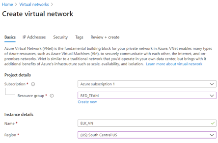

- Create a Peer connection between vNets. This allows traffic to pass between vNets and regions. It makes both a connection from the first vNet to the Second vNet _And_ a reverse connection from the second vNet back to the first vNet, allowing traffic to pass in both directions.

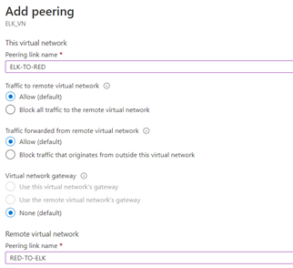

- Select vNet and view 'Peerings'.
- Peerings named Elk-to-Red
- RedTeam vNet labeled 'Virtual Network'.
- Resulting connection from  RedTeam Vnet to Elk vNet = "Red-to-Elk" 
- All other settings at their defaults
 
#### 2. Creating a New VM
Created a new virtual machine to run ELK.

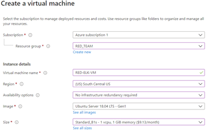

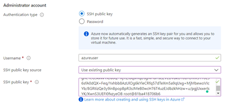
 
(public key
(ssh-rsa AAAAB3NzaC1yc2EAAAADAQABAAABAQDVhGkoToPcxT696ubUk95xm4V5kDXhg451dOrYkKr2hiZR+mHY6vMOJvgm+Hu8FpdR4CJ7CKOH1UcJm6C/JiaGJe3EvCOsfr6wf/RytpQ9R1wZpjAZorCCRLOBjpV5Bj/+4fP0VXro0KG+nghe1eG3kxWYX/a6Q+XjY2/bqsmqDsgNHuHsLZVEDvukO10BTOfvX5Y70LS6sfA0dQX+Feq/Yxhbb8AzUlOg6kYleCRfq57dTeXm5a9qUxg+MjMbewoVIcYb/8GRtizQe3y9inBpopBpR3sJMeB0wcH76T4uzEJdbzkhHzw+u/pgjUxxerlsYK/XwnS3UEFI0fxzyeOB root@81ba418706b6)

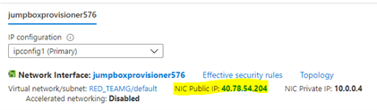

SSH into Jump-Box

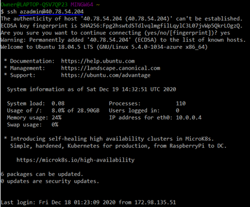

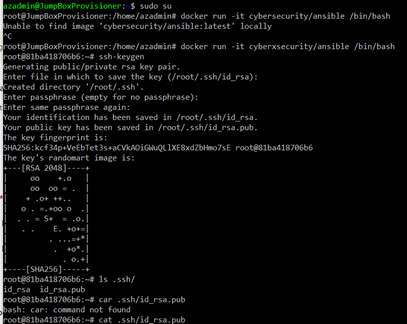

- Check for Ansible container:

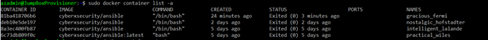
 
 
 
- Start container:

- Connect to the Ansible container:

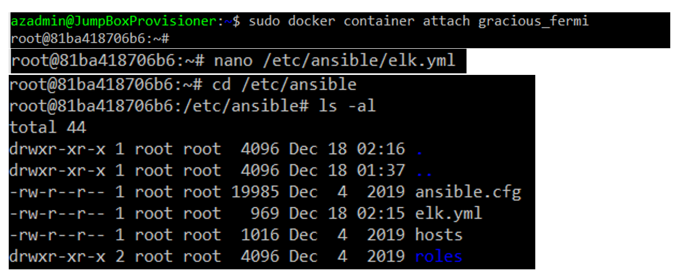

 
(public key)
ssh-rsa AAAAB3NzaC1yc2EAAAADAQABAAABAQDVhGkoToPcxT696ubUk95xm4V5kDXhg451dOrYkKr2hiZR+mHY6vMOJvgm+Hu8FpdR4CJ7CKOH1UcJm6C/JiaGJe3EvCOsfr6wf/RytpQ9R1wZpjAZorCCRLOBjpV5Bj/+4fP0VXro0KG+nghe1eG3kxWYX/a6Q+XjY2/bqsmqDsgNHuHsLZVEDvukO10BTOfvX5Y70LS6sfA0dQX+Feq/Yxhbb8AzUlOg6kYleCRfq57dTeXm5a9qUxg+MjMbewoVIcYb/8GRtizQe3y9inBpopBpR3sJMeB0wcH76T4uzEJdbzkhHzw+u/pgjUxxerlsYK/XwnS3UEFI0fxzyeOB root@81ba418706b6)

INSERT THIS PUBLIC KEY INTO NEW AZURE WM PASSWORDS & update

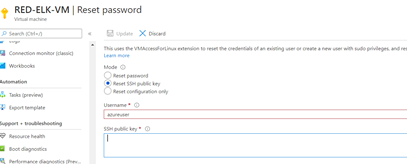
 
 
SSH into VM

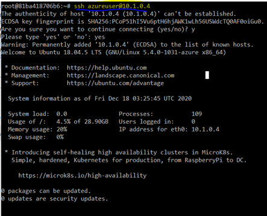
 

Configure a new VM using that SSH key.

- At least 4 GB of RAM.
- Public IP address.
- Added to  new vNet (ELK_VN) with new Security Group for it.

#### 3. Downloading and Configuring the Container

-New VM added to Ansible `hosts` file.
 
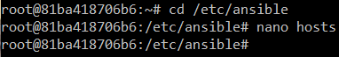

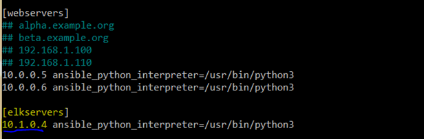
 
The IP address is the VMs private ip.

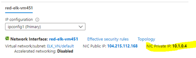
 

-New Ansible playbook for new ELK virtual machine.

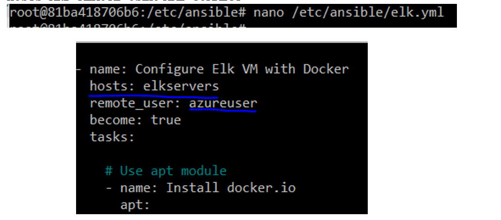

RUN ANSIBLE-PLAYBOOK /ETC/ANSIBLE/ELK.YML
 
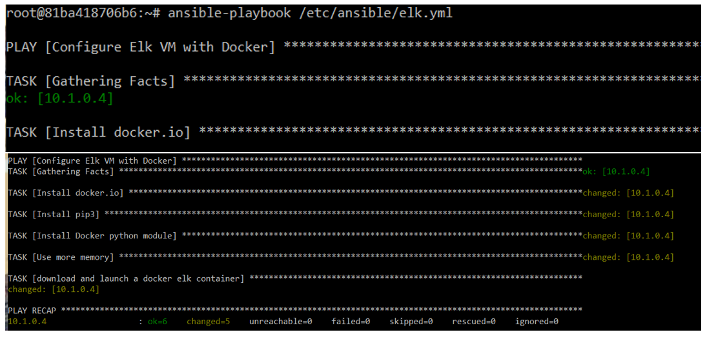

Increase Memory

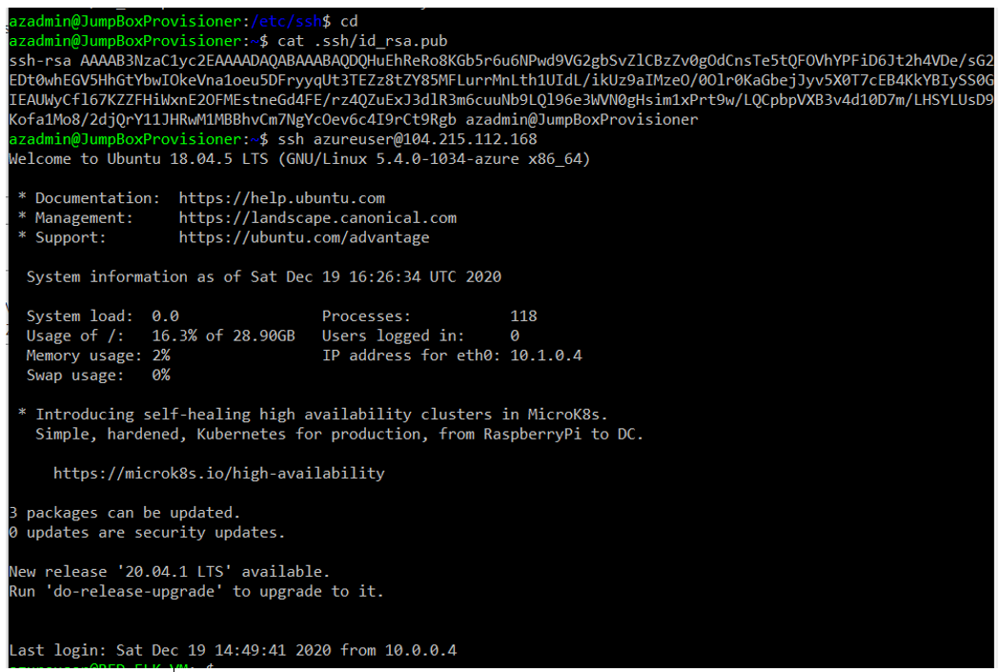

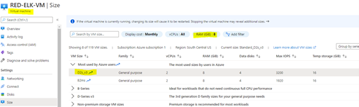

CHECK CURRENT MEMORY

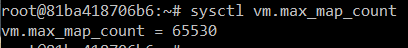

COMMAND TO INCREASE MEMORY

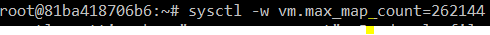

 
NEW PUBLIC KEY
ssh-rsa AAAAB3NzaC1yc2EAAAADAQABAAABAQDQHuEhReRo8KGb5r6u6NPwd9VG2gbSvZlCBzZv0gOdCnsTe5tQFOVhYPFiD6Jt2h4VDe/sG2EDt0whEGV5HhGtYbwIOkeVna1oeu5DFryyqUt3TEZz8tZY85MFLurrMnLth1UIdL/ikUz9aIMzeO/0Olr0KaGbejJyv5X0T7cEB4KkYBIySS0GIEAUWyCfl67KZZFHiWxnE2OFMEstneGd4FE/rz4QZuExJ3dlR3m6cuuNb9LQl96e3WVN0gHsim1xPrt9w/LQCpbpVXB3v4d10D7m/LHSYLUsD9Kofa1Mo8/2djQrY11JHRwM1MBBhvCm7NgYcOev6c4I9rCt9Rgb)
 

#### 4. Launching and Exposing the Container 
Download and run the `sebp/elk:761` container.
  - The container should be started with these published ports:
    - `5601:5601` 
    - `9200:9200`
    - `5044:5044`

NOW RUN THE ANSIBLE-PLAYBOOK /ETC/ANSIBLE/ELK.YML

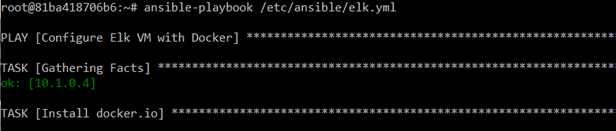
 

- SSH from Ansible container to ELK machine to verify the connection before running playbook.
- After ELK container is installed, SSH to container and double check that `elk-docker` container is running.

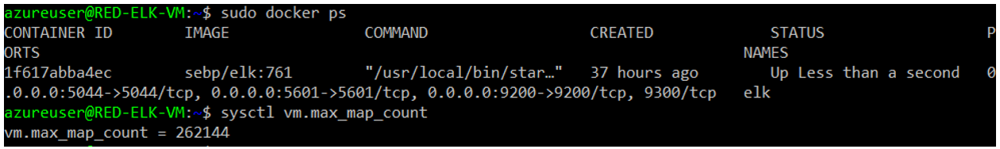

 
#### 5. Identity and Access Management
 
This ELK web server runs on port `5601`. 

Incoming rule for security group: Allow TCP traffic over port `5601` from IP address.
 
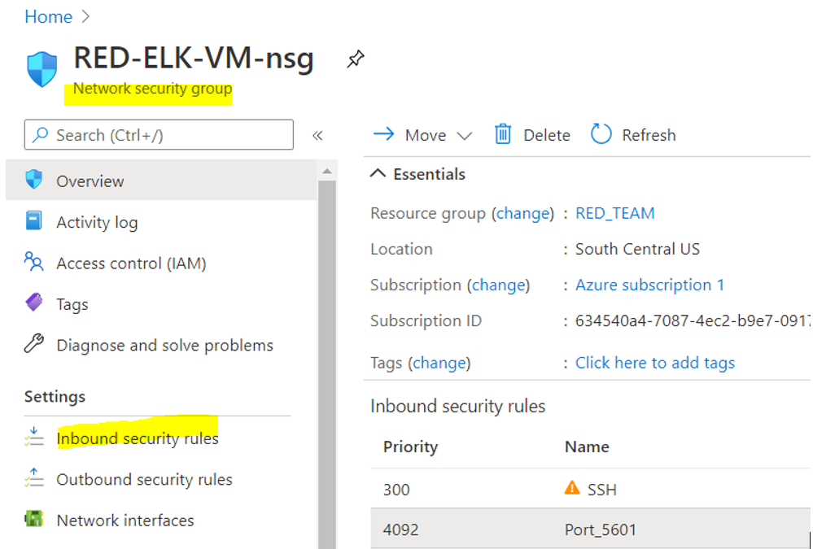

.png)
 
Verify by loading the ELK stack server from  browser at `http://[your.VM.IP]:5601/app/kibana`. 
(NOTE, THE IP ADDRESS CHANGES EACH TIME YOU START THE VM IN AZURE)

##### Filebeat Installation

#### 6. Installing Filebeat on the DVWA Container
Ensure ELK server container is up and running.
- Navigate to http://[your.VM.IP]:5601/app/kibana. Using the public IP address of the ELK server.
 
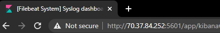

  - Verify that the container is on.

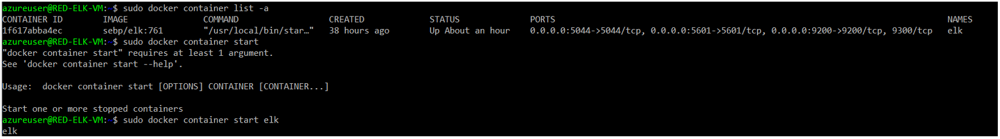

Install Filebeat on DVWA VM:
- Open ELK server homepage.
    - **Add Log Data** --> **System Logs** --> **DEB** (view the Linux Filebeat installation instructions)
 
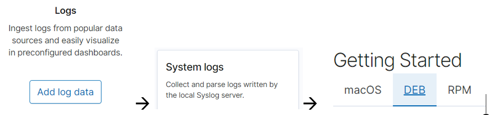

#### 7. Filebeat Configuration File
Create Filebeat configuration file with the correct settings to work with the ELK server.
Open a terminal and SSH into jumpbox:

 
Used [Filebeat Configuration File Template](config_files/filebeat-config.yml) configuration file for Filebeat to the Ansible container: 

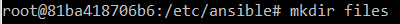
 

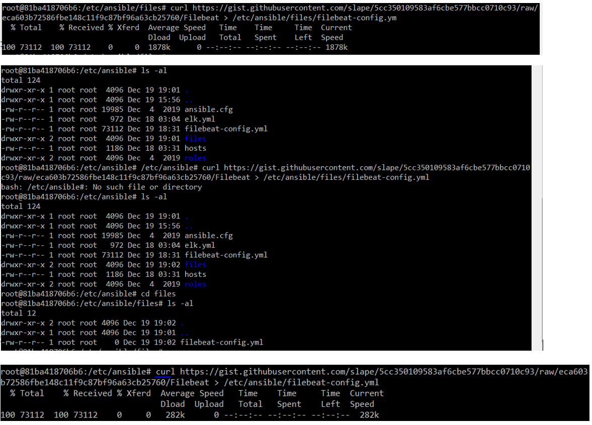
 
 
Once this file is on Ansible container, edit file as specified in the Filebeat instructions 

•	Scroll to line #1106 and replace the IP address with the IP address of your ELK machine.
-	NANO INTO THE FILEBEAT-CONFIG.YML FILE TO EDIT”
-	*ATL G* TO SEARCH BY LINE

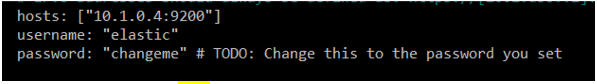

 
•	Scroll to line #1806 and replace the IP address with the IP address of your ELK machine.

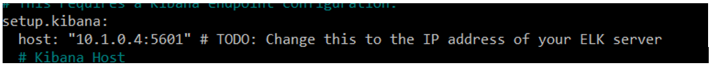

Save this file in  `/etc/ansible/files/filebeat-config.yml`.
-	*CONTROL O*
-	*CONTROL X* TO SAVE

#### 8. Creating Filebeat Installation Play
Create another Ansible playbook that accomplishes the Linux Filebeat installation instructions.
-	The playbook should:
-	Downloaded the `.deb` file from [artifacts.elastic.co](https://artifacts.elastic.co/downloads/beats/filebeat/filebeat-7.4.0-amd64.deb).
  - Installed the `.deb` file using the `dpkg` command shown below:
	`dpkg -i filebeat-7.4.0-amd64.deb`
- Copied the Filebeat configuration file from the Ansible container to WebVM's where Filebeat was installed
- Used Ansible module `copy` to copy the entire configuration file into the correct place.
- Placed configuration file in a directory called `files` in Ansible directory.
-	Run the `filebeat modules enable system` command.
-	Run the `filebeat setup` command.
-	Run the `service metricbeat start` command.
- After entering the information into the Filebeat configuration file and Ansible playbook, run: `ansible-playbook filebeat-playbook.yml`.

---> new puclic key created for web 1 and web 2 with username sysadmin
- ssh-rsa AAAAB3NzaC1yc2EAAAADAQABAAABAQDVhGkoToPcxT696ubUk95xm4V5kDXhg451dOrYkKr2hiZR+mHY6vMOJvgm+Hu8FpdR4CJ7CKOH1UcJm6C/JiaGJe3EvCOsfr6wf/RytpQ9R1wZpjAZorCCRLOBjpV5Bj/+4fP0VXro0KG+nghe1eG3kxWYX/a6Q+XjY2/bqsmqDsgNHuHsLZVEDvukO10BTOfvX5Y70LS6sfA0dQX+Feq/Yxhbb8AzUlOg6kYleCRfq57dTeXm5a9qUxg+MjMbewoVIcYb/8GRtizQe3y9inBpopBpR3sJMeB0wcH76T4uzEJdbzkhHzw+u/pgjUxxerlsYK/XwnS3UEFI0fxzyeOB
 
 
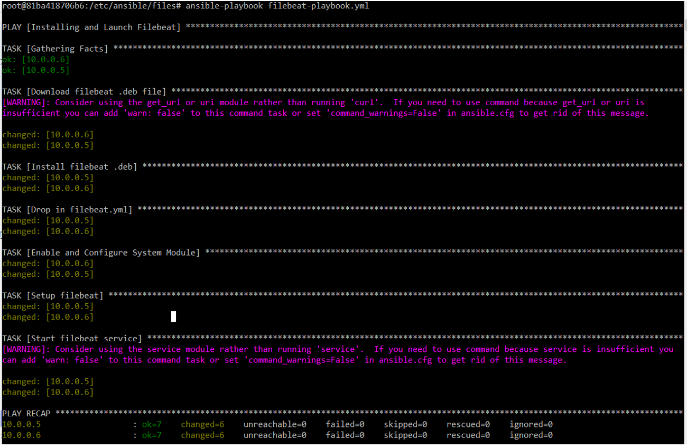

#### 9. Verifying Installation and Playbook 
Finally, confirm the ELK stack was receiving logs. Navigate back to the Filebeat installation page on the ELK server GUI.
- Verify that the playbook is completing Steps 1-4.
-  **Step 5: Module Status** --> **Check Data** --> **Verify Incoming Data**.

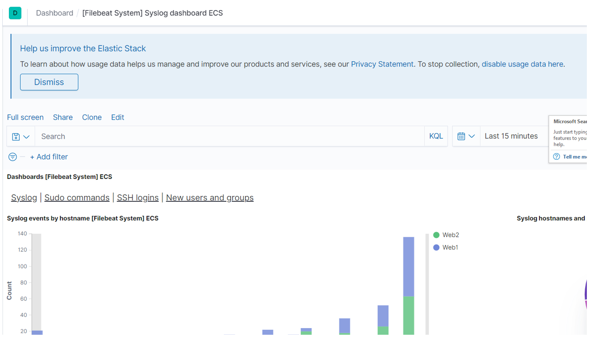

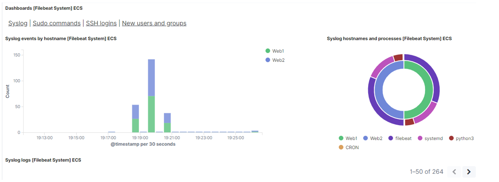

 

 
